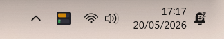
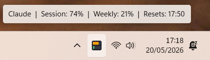

# Claude Usage Tracker — Windows

A lightweight Windows system tray app that shows your real-time Claude AI usage at a glance.





## What it shows

The icon displays two colour-coded progress bars:

- **S** — Session usage (5-hour rolling window)
- **W** — Weekly usage (7-day rolling total)

Colours shift green → amber → orange → red as usage increases. Hover over the icon for a full summary including reset time.

Right-click the icon for a menu with:
- Session %, Weekly %, and Sonnet % readouts
- Refresh Now
- Set Session Key
- Open claude.ai
- Start with Windows toggle
- Quit

## Requirements

- Windows 10 or 11
- **Python from [python.org](https://python.org)** (not the Windows Store version — the Store version blocks system tray access)
- A Claude Pro or Max subscription

## Installation

**1. Install Python from python.org**

Download from https://www.python.org/downloads/ and during install make sure to tick **"Add Python to environment variables"** on the Advanced Options screen.

**2. Install dependencies**

Open PowerShell in the project folder and run:

```powershell
python -m pip install pystray pillow requests
```

Or run `install.bat` from the folder.

**3. Start the app**

```powershell
Start-Process -FilePath "C:\Users\<you>\AppData\Local\Programs\Python\Python314\pythonw.exe" -ArgumentList "`"<full path to claude_tray.py>`""
```

Replace `<you>` with your Windows username and `<full path to claude_tray.py>` with the actual path to the script.

On first run, a dialog will prompt you for your session key.

## Getting your session key

1. Open [https://claude.ai](https://claude.ai) in Chrome or Edge
2. Press **F12** → **Application** tab → **Cookies** → click `https://claude.ai`
3. Find the row called `sessionKey`
4. Double-click its Value cell and copy the full text (starts with `sk-ant-sid01-...`)

Your session key is stored locally at `~/.claude_usage_tracker.json`. It is never sent anywhere except to `claude.ai` directly.

> **Security note:** Treat your session key like a password. Do not share it or commit it to version control.

## Auto-start with Windows

Right-click the tray icon and select **Start with Windows** to toggle automatic launch on login.

Alternatively, run this PowerShell command once to create a startup shortcut:

```powershell
$shell = New-Object -ComObject WScript.Shell
$shortcut = $shell.CreateShortcut("$env:APPDATA\Microsoft\Windows\Start Menu\Programs\Startup\Claude Usage Tracker.lnk")
$shortcut.TargetPath = "C:\Users\<you>\AppData\Local\Programs\Python\Python314\pythonw.exe"
$shortcut.Arguments = '"<full path to claude_tray.py>"'
$shortcut.WorkingDirectory = "<folder containing claude_tray.py>"
$shortcut.Description = "Claude Usage Tracker"
$shortcut.Save()
```

## Antivirus note

Some antivirus tools (including Avast) may flag `.bat` files in this folder as a false positive (`IDP.Generic`). This is a known issue with batch files that launch Python scripts. The Python script itself (`claude_tray.py`) is safe to inspect — all source code is visible. Add the folder to your antivirus exclusions if needed.

## How it works

The app calls the Claude API endpoint your browser uses:

```
GET https://claude.ai/api/organizations/{org_id}/usage
```

authenticated with your `sessionKey` cookie. No third-party services are involved.

Usage data refreshes every 60 seconds.

## Inspired by

The [macOS Claude Usage Tracker](https://github.com/hamed-elfayome/Claude-Usage-Tracker) by [@hamed-elfayome](https://github.com/hamed-elfayome).

## Licence

MIT
